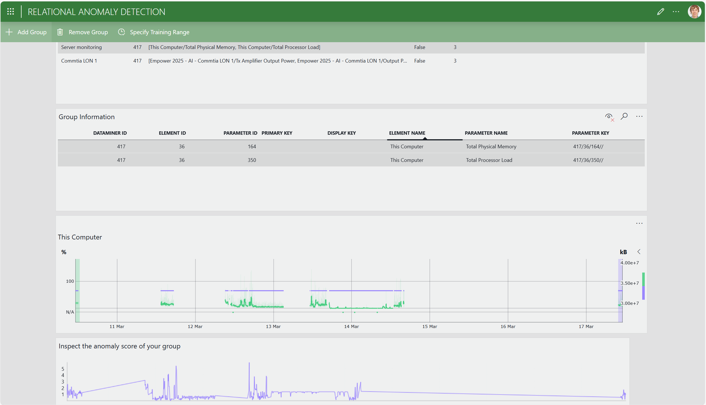
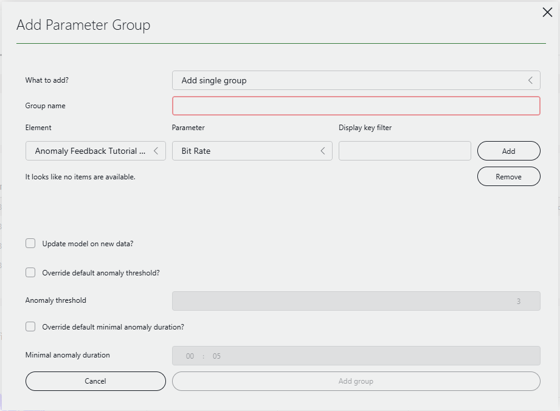
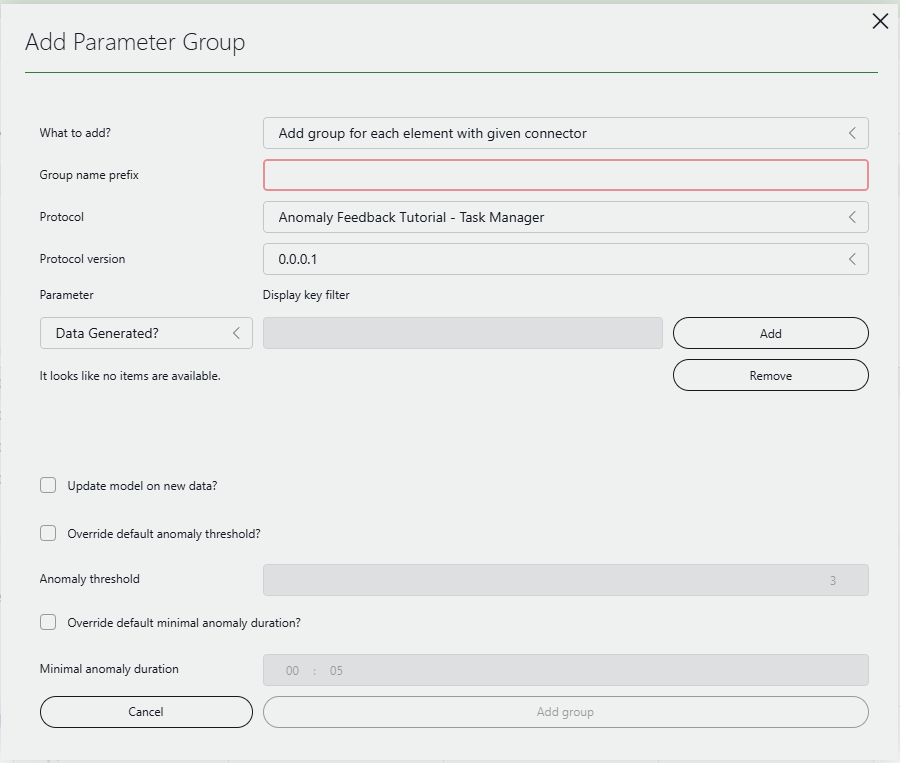
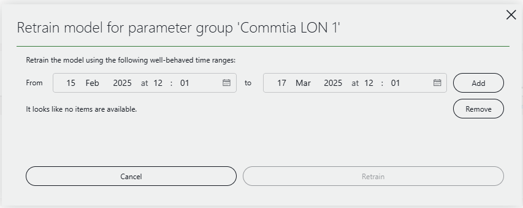

# Easily configure Relational Anomaly Detection and inspect its results

[Relational Anomaly Detection (RAD)](https://docs.dataminer.services/user-guide/Basic_Functionality/Alarms/Working_with_alarms/Advanced_analytics_features/Relational_anomaly_detection.html) is a powerful feature that can detect when a group of parameters deviates from its normal behavior. It can be used in many different scenarios such as monitoring whether main and backup channels are in sync, checking whether load balancing is performing optimally, tracking health of battery cells and many more.

This app allows you to easily configure the parameters that Relational Anomaly Detection monitors and the settings that should be used. It also visualizes the results by showing you a graph of the historical anomaly scores.

The table under *Your Relational Anomaly Groups*, near the top of the app, shows the all parameter groups that are currently being monitored by RAD. When you first starting the app, this will probably be empty. To add a new group, select [*Add Group*](#adding-a-parameter-group) in the header bar. For each group, the table shows the name of the group, a list of parameter instances that belong to the group, and various configuration options.

After selecting a group in the table above, the *Group Information* table below shows information about all parameter instances that belong to that group. You can select one or more parameter instances in this table to display their trend graph below.

Finally, the line graph at the bottom, under *Inspect the anomaly score of your group*, shows you the anomaly score that RAD gives to the parameter group at any given time. If this score is high, then RAD considers the behavior of the parameter at that time to be anomalous; if it is low, then it considers the behavior to be normal. By default, an anomaly score greater than 3 is considered anomalous. If such a score is detected on new data, a *Suggestion event* will be created, which is visible in the *Suggestion events* tab in the Alarm Console in Cube.

## Adding a parameter group

You can select *Add Group* in the header bar on the top-left to add a new parameter group to be monitored by RAD. This will open the following dialog.

Under *What to add?*, you have two options *Add single group* and *Add group for each element with given connector*.

### Add single group

The *Add single group* option allows you to configure a single group of parameters to be monitored by RAD. You need to specify a group name, and add at least two parameter instances to the group. To add a parameter instance, first select the correct element from the dropdown under *Element*, then select the parameter and, in case of a table parameter, specify the display key of the parameter instance. Finally, press the *Add* button. Repeat the process to add additional parameter instances. You can specify multiple instances for the same parameter by using \* as a wildcard. When finished, press *Add group*.

In addition to the name and the parameter instances, you can also specify several other options. For more information on these options, see [Configuring parameter groups for RAD](https://docs.dataminer.services/user-guide/Basic_Functionality/Alarms/Working_with_alarms/Advanced_analytics_features/Relational_anomaly_detection.html?q=Relational#configuring-parameter-groups-for-rad).

> [!NOTE]
> You can only monitor trended parameters with RAD. Moreover, all parameter instances in a single group should be hosted on the same DataMiner agent.

### Add group for each element with given connector

The *Add group for each element with given connector* option allows you to create similar groups for each element with a given connector. You can specify the connector and several parameter instances of that connector, and it will then create a group with the given parameter instances for each element using that connector.

Under *Group name prefix* you need to specify a prefix. The name of the resulting groups will be of the format *\[PREFIX\] \(\[Element name\]\)*. Below, you can specify the connector and connector version. Once you have selected these, you must add at least two parameter instances to the group. As before, you can specify the display keys for table parameters using \* as a wildcard. Press *Add* to add the parameter instance to the group. Note that if a particular display key only exists on certain elements of the specified connector, the corresponding instance will be added only to the parameter groups of those elements.

As above, several other options can also be configured below the parameter instances. For more information on these options, see [Configuring parameter groups for RAD](https://docs.dataminer.services/user-guide/Basic_Functionality/Alarms/Working_with_alarms/Advanced_analytics_features/Relational_anomaly_detection.html?q=Relational#configuring-parameter-groups-for-rad).

## Removing a parameter group

The *Remove Group* button in the header bar (next to *Add Group*) removes the group selected in the table under *Your Relational Anomaly Groups*. This group will then no longer be monitored by RAD.

## Specify Training Range

The *Specify Training Range* button in the header bar can be used to retrain the selected parameter group on a specific time range. This can to improve the accuracy of the algorithm in some cases: RAD decides whether a certain behavior is anomalous or not based on the behavior it has seen in its training data. By default, all 5-min average trend data (with a maximum of 2 months) that was available when the group was first added, is used. If this default time range contains anomalous data, if only limited data was available when the group was added, or if one or more parameters have changed behavior since the initial training, it may be useful to retrain the parameter group using a specified time range.

Selecting the *Specify Training Range* button, opens the dialog above. You can specify one or more time ranges to be used for training the selected parameter group. To add a time range, select the desired start and end time in the pickers near *From* and *to*, and then press *Add*. Repeat the process to add additional time ranges. Once you have added the desired time ranges, you can press the *Retrain* button. This will immediately retrain the parameter group, and you will see the resulting anomaly scores in the main window under *Inspect the anomaly score of your group*.
